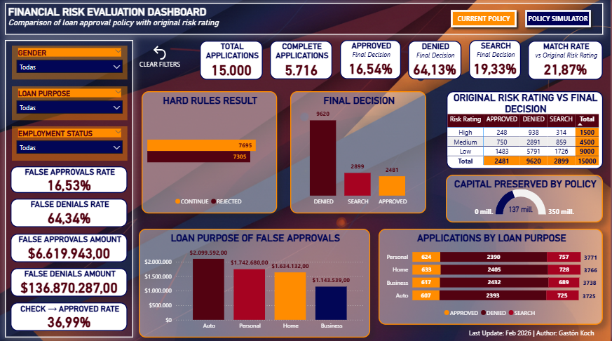
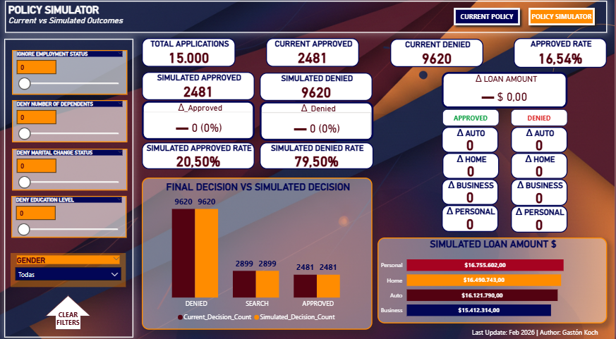

# 📊 Financial-Risk-Evaluation – Power BI  
Interactive dashboard to analyze and simulate loan approval policies and measure business impact.  

## 📌 Project Overview
This project consists of a financial dashboard designed to analyze and simulate credit approval policies. Using a dataset of 15.000 loan applications, I developed a dual-layered solution: an audit of the current policy and a dynamic simulator to predict the impact of adjusting risk parameters on the portfolio's approval rates and capital preservation.  

## 🛠️ Key Technical Challenges  
**1. Data Integrity & Discretionary Logic**  
The raw dataset (sourced from Kaggle) contained significant missing values. This required a high degree of analytical discretion:  
Data Cleaning: Implemented logic to handle nulls without biasing the risk profile.  
Expert Judgment: Decisions were made to categorize incomplete profiles based on secondary financial indicators, ensuring the model remained robust for risk assessment.  
**2. Complex Policy Modeling (145 Rule Combinations)**  
Rather than relying on simple filters, I engineered a comprehensive Approval Policy Table:  
Created a logic matrix with 145 possible combinations of borrower attributes.  
Data Engineering: Used Power Query (Append/Merge) to integrate this ruleset with the main dataset, creating a "Tree Decision" engine that dictates the Final Decision for every row.  
**3. Dynamic Scenario Simulation (DAX)**  
The core value proposition is the Policy Simulator. Using "What-If" parameters and advanced DAX (SUMX, TREATAS, and VAR), I built a real-time environment where stakeholders can:  
Toggle rules (e.g., "Deny by Education Level" or "Ignore Employment Status").  
Instantly visualize the Delta ($\Delta$) in approval counts and loan amounts across different loan purposes (Auto, Home, Business, Personal).  

## 🧠 Features
✅ Base policy performance analysis  
✅ Policy simulator (what-if parameters)  
✅ Hard rules engine in DAX  
✅ Dynamic KPIs  
✅ Approval / Denial comparison  
✅ Loan purpose impact analysis ($ and volume)  
✅ False approvals & false denials metrics  
✅ Optimized performance measures  

## 🚀 Skills Demonstrated  
**Data Engineering:** Power Query, Data Modeling, Handling Missing Data.  
**Advanced Analytics:** DAX (Context Transition, Table Iterators), Risk Modeling.  
**UI/UX Design:** Financial Dashboarding, Conditional Formatting, User-Centric Navigation.  

## 📸 Screenshots
### Current Policy
  
### Policy Simulator  
  

## 🔗 Live Demo
Power BI Service link: https://app.powerbi.com/links/ksdM5R93jv?ctid=feedc0c6-bc8a-4751-ac17-3e833e8121d0&pbi_source=linkShare  

## 📂 File  
👉 [Download the PBIX](Financial-Risk-Evaluation.zip)  

## 👤 Author
Gastón Koch
Business Intelligence | Data Analytics  
